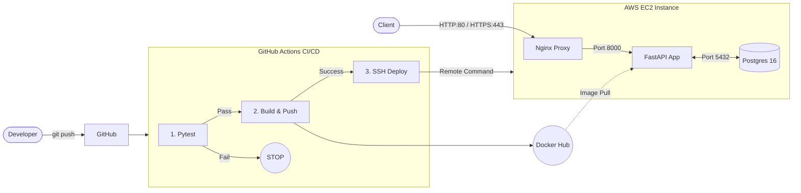

# boltAPI

boltAPI is a high-performance RESTful API backend designed for social media-style CRUD operations. Built to demonstrate a complete production-grade backend lifecycle, it integrates strict data validation, relational database management, and a fully automated CI/CD pipeline.

## System Architecture

The following diagram illustrates the infrastructure and deployment flow of the application:



## Tech Stack

* **Application Framework:** FastAPI (Python)
* **ORM & Data Validation:** SQLModel (combining Pydantic and SQLAlchemy paradigms)
* **Database:** PostgreSQL 16 (Synchronous driver via `psycopg2-binary`)
* **Migrations:** Alembic (Executed automatically via Docker entrypoint)
* **Containerization:** Docker & Docker Compose (Environment-specific configurations)
* **Infrastructure:** AWS EC2 (`t3.micro` running Ubuntu 24.04 LTS)
* **Reverse Proxy:** Nginx (Routing to Uvicorn application server)
* **Testing:** Pytest

## Key Implementation Details

### Data Layer & Migrations
The application utilizes `SQLModel` for schema definitions and database interactions, providing robust type-hinting and validation. Database migrations are handled by Alembic. In the production environment, the Docker container utilizes an `entrypoint.sh` script to automatically apply pending Alembic migrations before starting the Uvicorn server, ensuring the database schema is always synchronized with the application code.

### Security & Authentication
* **Stateless Authentication:** Implements JWT (JSON Web Tokens) using the HS256 algorithm for secure, stateless API access.
* **Cryptography:** Bypasses unmaintained wrapper libraries (like `passlib`) in favor of a direct, custom implementation using the standard `bcrypt` library. This ensures clean execution without deprecation warnings and provides explicit control over salt generation and hash verification.
* **Infrastructure Security:** EC2 instance is secured via UFW (Uncomplicated Firewall), restricting incoming traffic strictly to HTTP/HTTPS ports, with Nginx acting as a reverse proxy to shield internal application ports.

### Testing Strategy
The application maintains high reliability through a comprehensive test suite using pytest.
* **Fixtures:** Utilizes `conftest.py` to modularize setup and teardown operations, including isolated database sessions, test clients, and authenticated user token generation.
* **Parametrization:** Employs pytest.mark.parametrize across test modules (`test_user.py`, `test_post.py`, `test_vote.py`) to systematically validate endpoints against multiple input payloads and edge cases without code duplication.

### Continuous Integration & Deployment (CI/CD)
The deployment lifecycle is fully automated using GitHub Actions. The pipeline executes in three distinct stages:
1. **Testing:** Executes the `pytest` suite to validate application logic.
2. **Build & Push:** Builds the updated Docker image and pushes it to Docker Hub.
3. **Automated Deployment:** Establishes an SSH connection to the AWS EC2 instance, pulls the latest registry image, and recreates the containers with zero-downtime using Docker Compose.

## Local Development Setup

The project uses Docker for dependency isolation and environment consistency.

1. **Clone the repository:**
```bash
git clone https://github.com/1n11it/boltAPI
cd boltAPI
```
2. **Configure Environment Variables:**
Copy the template file and populate the required keys (e.g., Database credentials, JWT Secret).
```bash
cp .env.example .env
```
3. **Initialize the Application:**
Use the development compose file to spin up the API and PostgreSQL database.
```bash
docker compose -f docker-compose-dev.yml up -d
```
## Live Demo & API Documentation

The API is deployed and actively hosted. The root endpoint automatically redirects to the Redoc documentation for immediate accessibility, while interactive testing is available via Swagger UI.

* **Base URL:** `https://boltapi.site`
* **Root Redirect:** Navigating to the base URL automatically serves the Redoc interface.

### Documentation Endpoints
FastAPI automatically generates comprehensive OpenAPI documentation. Two interfaces are exposed:

1. **[Interactive Docs (Swagger UI)](https://boltapi.site/docs):** Best for active testing, executing requests, and viewing real-time JSON responses and validation errors.
2. **[Reference Docs (Redoc)](https://boltapi.site/redoc):** Best for reading static, structured documentation with clear schema definitions and payload examples.